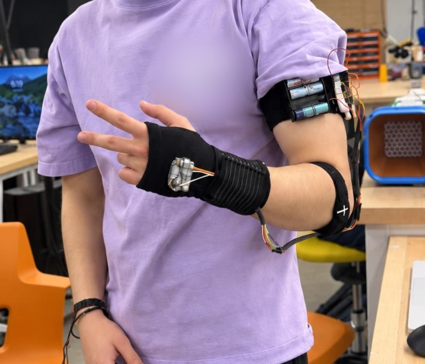
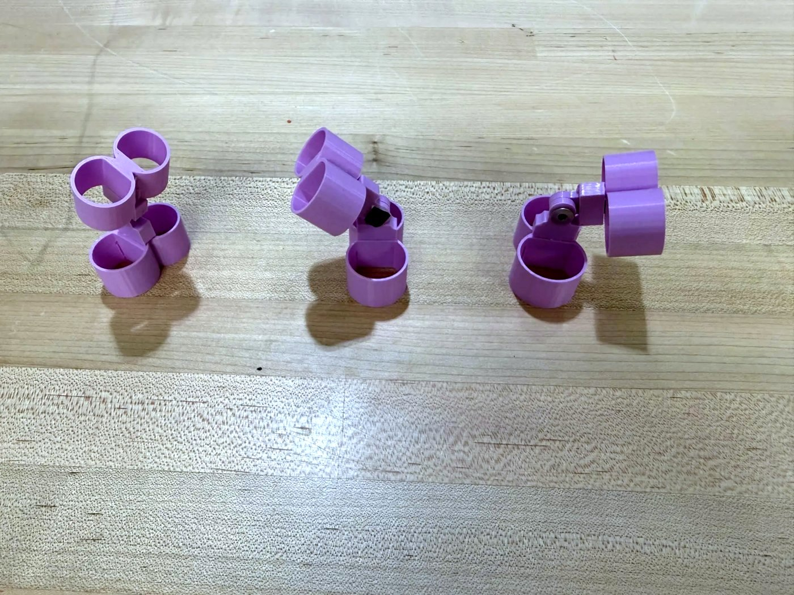
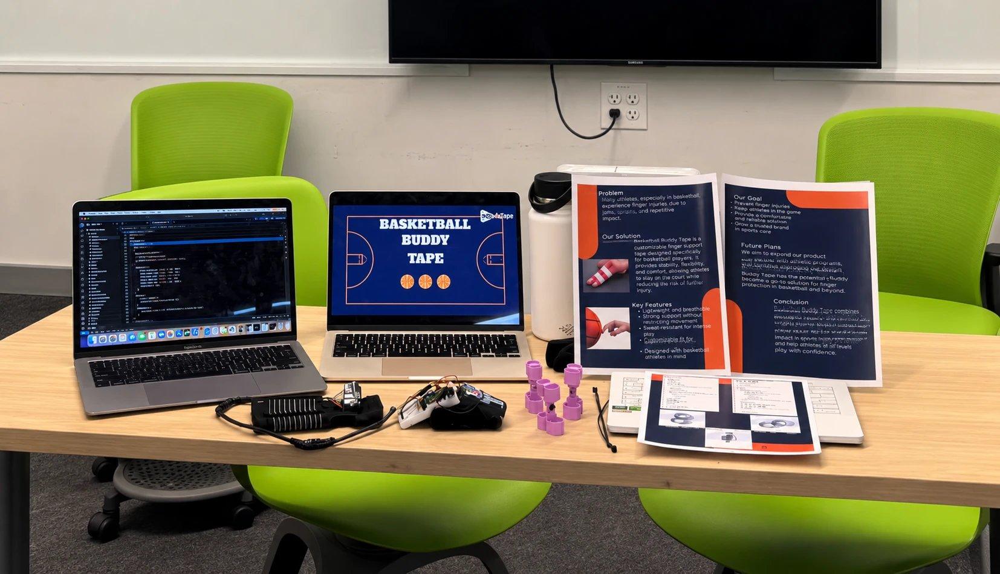

# Basketball Brace Motion Tracker

A wearable motion tracker I used to test whether our finger brace changes how a player dribbles. A Raspberry Pi Pico reads an MPU6050 IMU at 100 Hz and logs every trial to a CSV, and a MATLAB script compares trials with the brace on and off. The goal was a brace that limits wrist rotation without taking away hand force.

Built for GE1502 (Cornerstone of Engineering 2) at Northeastern, Spring 2026, as a team project. I picked the sensor, wired it into the Pico, and wrote all the code, both the logger and the MATLAB analysis. My teammates built the physical brace.

The IMU sits on the back of the hand and the battery pack is strapped to the upper arm.

## The brace

The brace is Basketball Buddy Tape, a 3D printed finger support for basketball players that comes in 3 sizes.

## Hardware

- Raspberry Pi Pico running MicroPython
- MPU6050 6-axis IMU (accelerometer + gyroscope) on I2C: SDA on GP4, SCL on GP5
- Push button on GP15 (internal pull-up) to start and stop recording
- The Pico's onboard LED as a status light: fast blink means the sensor wasn't found, slow blink means it's calibrating, solid means ready, and quick flashes mean a trial was saved

## How the logger works

[`logger/mpu6050_logger.py`](logger/mpu6050_logger.py)

- **Setup.** Resets and wakes the MPU6050, then sets it to ±8 g (dribbling impacts go way past 2 g) and ±500 °/s, with the built-in low-pass filter on to cut noise
- **Calibration.** Averages 500 samples while the sensor sits still to get each axis's offset. The z axis is expected to read 1 g, not 0, since it points up during calibration
- **Reading.** One 14-byte I2C read gets all six axes at once, which get converted from raw counts to m/s² and °/s
- **Recording.** A button press starts a new trial file (`trial_01.csv`, `trial_02.csv`, ... never overwriting), and another press saves it. The file is flushed every 50 rows, so a dead battery only loses half a second
- **Steady 100 Hz.** Each loop measures how long the read and write took and only sleeps for what's left of the 10 ms. A fixed 10 ms sleep would drift slower than 100 Hz

CSV columns: `timestamp_ms, ax, ay, az, gx, gy, gz`

## How the analysis works

[`analysis/BraceDataAnalyzer.m`](analysis/BraceDataAnalyzer.m)

1. Loads the brace on (`trial_01`) and brace off (`trial_02`) trials and checks the real sample rate from the timestamps
2. Smooths each axis with a 10-sample (0.1 s) moving average
3. Combines the three axes into acceleration and rotation magnitudes, so it doesn't matter how the sensor sits on the wrist
4. Finds dribble impacts and wrist snaps with a custom peak detector. A point counts if it's higher than both neighbors, above a threshold (15 m/s² for impacts, since gravity alone is 9.81, and 100 °/s for rotation), and at least 0.15 s after the last peak. It doesn't need MATLAB's Signal Processing Toolbox
5. Computes 10 stats per trial: peak, mean and spread of force and rotation, peak counts, and dribble tempo
6. Compares brace on vs off and prints a takeaway. Changes under 10% count as no real difference, since it's one trial each

## Running it

1. Copy `logger/mpu6050_logger.py` to the Pico as `main.py` so it runs on power-up
2. Keep the sensor still and flat until the LED goes solid, then press the button, dribble, and press it again to save
3. Copy the CSVs from the Pico into `data/` and run `analysis/BraceDataAnalyzer.m` in MATLAB

The two trials in `data/` are about 7 seconds each at 100 Hz.

## Demo day

*Our demo table with the tracker, the brace sizes and the poster. This photo was AI-enhanced because the original was very blurry.*
